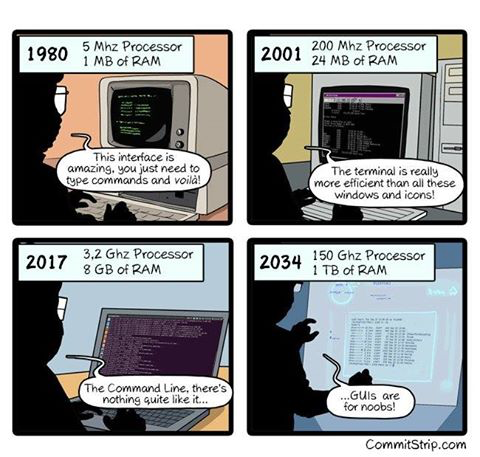

= Command Line Basics
Chuck Frain
:backend: deckjs
:navigation:
:split:

////
This presentation is intended to be a basic introduction to Linux command line concepts.
This is not intended to be comprehensive nor are the commands explained meant to be complete.
Please use the information here as a guideline to start from to begin understanding concepts.
////

////
ideas to add
cp (-R)
mv
~
////

== Command Line Basics

== Different Distros
// I don't think this is really needed here

There are many different Linux distributions.
The most common ones are, in no particular order:

* Red Hat/CentOS
* Fedora
* Ubuntu
* SUSE
* Debian

== File structure

* File locations differ between distributions
* Common directories
** `/` (Root of the file system)
** `/root` (root user's home directory)
*** This is not the root(`/`) of the file system
** `/home/$USER` (Your files)
** `/etc` (System configuration files)
** `/media` (Mount points for removeable systems)
** `/opt` (Typically software packages installed in one place)
// Need to reword the opt dir description
** `/var` (Variable files that change regularly)
** `/var/log` (Common default location for log files)

== CLI installers

`yum install <package>`

`apt-get install <package>`

* `yum`/`dnf`
** Red Hat
** CentOS
** Fedora
** SUSE
* `apt-get`
** Debian
** Ubuntu

== Basic Navigation

* CasE SensItiVity MatTERs
* tab completion to complete command names, paths, or files
* `pwd` (Print working[current] directory)
* `ls` (list files in directory)
* `cd` (Change Directory)
** `cd /path/to/directory` changes from the current directory to the defined directory
** `cd ~` changes from the current directory to the user's home directory
** `cd ..` changes from the current directory to the directory one level up
** `cd ../../path/to/directory` changes from the current directory to two levels up then down to the new directory

== Permissions

The following is the output of `ls -lah` (long list,all files,human readable)
// [source,bash]
----
total 40
drwxr-xr-x   6 chuck  staff   204B May 25  2016 .
drwxr-xr-x  16 chuck  staff   544B Oct 24 21:25 ..
drwxr-xr-x   5 chuck  staff   170B May 25  2016 fixtures
-rw-r--r--   1 chuck  staff   6.0K May 25  2016 .coffee
-rw-r--r--   1 chuck  staff   2.8K May 25  2016 image-factory-spec.coffee
-rw-r--r--   1 chuck  staff   6.0K May 25  2016 main-spec.coffee
-rw-r--r--   1 chuck  staff   7.5K May 25  2016 main-url-support-spec.coffee

----------   - -----  -----   ---- ------------ ----------------------------
    |        |   |      |       |       |             |
    |        |   |      |       |       |             +    File Name
    |        |   |      |       |       |
    |        |   |      |       |       +-----------  Modification Time
    |        |   |      |       |
    |        |   |      |       +-------------------   Size (in bytes)
    |        |   |      |
    |        |   |      +---------------------------        Group
    |        |   |
    |        |   +----------------------------------        Owner
    |        |
    |        +--------------------------------------        Links
    |
    +-----------------------------------------------   File Permissions
----
(Diagram from linuxcommand.org)

== Permissions

[cols=1*^,frame=none,grid=none]
|===
|drwxr-xr-x
|TUUUGGGOOO
|===

[cols=2*,options="header",frame=topbot]
|===
|Field |Definition
|T a|File Type

* `-` file
* `d` directory
* `l` symlink
|U |User/Owner Permissions
|G |Group Permissions
|O |Other User's permissions
|===

// == Permissions
<<<

`rwx`

[cols=3*,options="header"]
|===
|Character
|Effect
|Numerical Value
|r |read |4
|w |write |2
|x |execute |1
|===

`chmod` changes the permissions of the file or directory

`chmod 644 filename` = -rw-r--r-- permissions to the file

`chmod 775 filename` = -rwxrwxrw- permissions to the file

`chmod 654 dirname` = drw-r-xr-- permissions to the file

== Useful Commands

[cols=2,options="header"]
|===
|Command |Function
a|* vi/vim
* emacs
* pico/nano |For editing files
|cp |for copying files
|mv |for moving/renaming files
|rm |for removing/deleting files or directories
|find |for finding files
|grep |for finding stuff in files
|tail/head |for viewing end/beginning of files
|service/systemctl |for starting/stoping/controlling services
|less |show the contents of a file at the cli
|man |for learning how to use commands
|chmod |for modifying file permissions
|tar |for compressing and decompressing files
|sudo |for running a command as a different user, typically root
|===

== vi/vim commands

`vim filename` - opens the designated file in normal mode

`:help` - displays the vim help file

`/texttosearch` - search for text in the document (case sensitive)

`i` - insert mode to edit the file

`esc` - return to command mode

`:wq` - write/save the file and quit the editor

`:q!` - quit the editor without saving the changes

== cp command

`cp filename /path/to/copy/to`

`cp filename newfilename`

copies the file from the current location/name to the new location/name

`cp -R /path/to/directory /path/to/new/directory`

copies the the files and directories from the specified directrory to the new location

== mv command

`mv filename /path/to/new/location`

`mv filename newfilename`

moves the file from the current location/name to the new location/name.

== rm command

`rm filename`

deletes the indicated file

`rm -rf directoryname`

deletes the indicated directory and all of its contents, including hidden files

== find command

`find . -name 'filename.txt'`

Searches for the filename.txt file in the current directory and sub directories

Other popular factors to search on include owner, time, type, size, file types, and many others

== grep command

`grep -iR pattern Documents/`

Searches files for the phrase `pattern` in a case insensitive(i) manner in and below\(R) the local `Documents` directory.

== head/tail commands

`head -n 15 filename.txt`

`head` displays the first lines of a file (10 by default, 15 in the above example)

`tail -n 15 filename.txt`

`tail` displays the last lines of a file (10 by default, 15 in the above example)

`tail -f filename.txt`

The above use of the `tail` command with the `-f` flag continually rereads and displays the end of the file.
This is useful when monitoring a log file in real time, for example.
Use <ctrl>-c to stop reading the file.

== service/systemctl commands

The `service` and `systemctl` commands control the status of services on the system.
The following examples are for controlling the Apache web server status.

`systemctl {start,stop,restart,status} httpd`

`service httpd {start,stop,restart,status}`

== man command

`man <command>`

The man command displays the manual (help) page for the command indicated.

== less command

`less filename`

Displays the contents of a file in the terminal window.
Use the up and down arrows to navigate the file.
Use a forward slash followed by text to search for to find particular types.

`/texttosearchfor`

== tar command

`tar zxvf filename.tar.gz`

Extracts the contents of the tar.gz file to the current directory

`tar zcvf newcompressedfile.tar.gz file1 file2 file3`

Creates a new compressed file containing all the files indicated in the command

`tar zcvf newcompressedfile.tar.gz /path/to/files`

Creates a new compressed file containing all the files in the indicated directory

== sudo command

`sudo ls /var/log/messages`

By default, runs a command as the `root` user.
Adding `-u <user>` will specify a different user to run the command as.

== Pipe commands from one to another on a single line
// I'm not sure if join is the right word here

The pipe `|` symbol passes the output of a command to another command.
The following command will output the contents of `filename.txt` and send it to the `grep` command.
The `grep` command then passes on only the lines of text that contain the word `address` and writes it `>` to the `addresses.txt` file.

`less filename.txt| grep address > addresses.txt`

== Other interesting commands and concepts to follow up on

These are commands that are useful to know but fall into a niche category.

* netstat/ss - for showing open ports
* firewall-cmd - for configuring firewall rules
* nmtui - for configuring network manager from the command line
* git - version control for files
* sed - Stream line editor to change file contents without opening a full editor
* `^n` reads as ctrl-n
* `!!` adds the last command to the current command line
* `md5sum` `sha1sum` (and others) creates a unique hash of a file to easily compare two or more files
* `ssh` creates a secure shell connection between two computers
* `scp` securely copies files between computers
* environmental variables - easily share configuration settings between applications and processes such as $USER, $HOME, $EDITOR, $BROWSER

== Dangerous commands

These commands should not be used unless you really understand what you're doing with them.

`rm -rf /` - Will delete the entire file system

`mv file /dev/null`

`:(){:|:&};:` - a fork bomb which creates a function and exectues twice until the system freezes

`$COMMAND > /dev/sda` - overwrites data on the block device, in this case the main drive

`mkfs.* /dev/sda` - formats the block device, in this case the main drive

For more, search for `dangerous linux commands` in your favorite search engine

== Bash system files
// list and describe various bash config files

`.bashrc` - configuration file for non-login shells

`.bash_profile` - configuration for login shells

`.bash_history` - history of the recent commands run in the bash shell

== Troubleshooting

log files are your friend

Common Location -- /var/log

Read recent system messages -- `tail /var/log/messages`

Print Kernel messages -- `dmesg`

== Resources

* `vimtutor` to learn vim from the command line
* Vim Adventures https://vim-adventures.com (pay past level 3)
* Command Line tutorial http://linuxcommand.org/lc3_learning_the_shell.php
* Command Line Magic https://twitter.com/climagic
* Explains the entered command based on the man page http://explainshell.com
* Test your regex expressions http://regex101.com
* Practice your knowledge of regex http://regexcrossword.com
